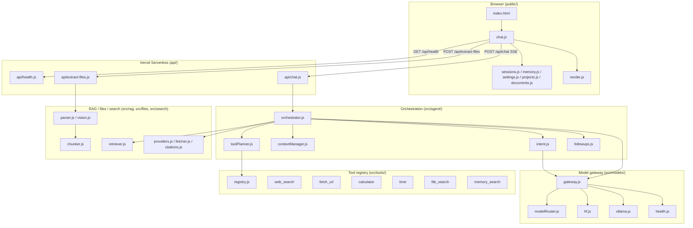

# unsense — Architecture & Workflow Reference

This document explains what the project is, how every part works, and where
code lives. The repository is authoritative — if this doc and the code ever
disagree, trust the code and fix this doc.

---

## 1. What this project is

**unsense** is a browser-based AI assistant that:

- Sends messages to **Hugging Face Router** (Featherless-hosted open models), with an optional **Ollama** adapter for a fully local/offline mode
- Streams responses over SSE, with a working Stop button
- Decides per-message whether to run an **agentic web search** (DuckDuckGo), retrieve from **uploaded documents** (chunked + lexically ranked, not dumped whole), or use **long-term memory** (user-curated, never auto-mined)
- Runs entirely on **Vercel serverless functions** in production — there is no server-side database. Everything that needs to persist (chat history, memory, settings, projects) lives in the browser's `localStorage`.

That last point shapes a lot of the design, so it's worth stating explicitly:
**this is a deliberate choice** (zero-infra, zero additional cost, nothing to
provision), not an oversight. The tradeoff is that memory/history/projects
don't sync across devices or browsers, and "semantic" retrieval is lexical
(BM25), not embedding-based, because no vector store or embeddings provider
is configured. The retrieval and memory interfaces (`src/rag/retriever.js`,
`src/memory/format.js`) are written so a real backend could be swapped in
later without changing their call sites.

---

## 2. High-level architecture



---

## 3. Project structure

```
unsense/
├── api/                          # Vercel serverless entrypoints (production)
│   ├── health.js
│   ├── chat.js                   # POST /api/chat — SSE stream
│   └── extract-files.js          # POST /api/extract-files
│
├── public/                       # Static frontend (served at /)
│   ├── index.html
│   ├── chat.js                   # Main frontend orchestration (SSE, sessions, UI wiring)
│   ├── render.js                 # Markdown/citation/code/math rendering
│   ├── sessions.js               # localStorage session storage + schema migration
│   ├── memory.js                 # localStorage long-term memory (user-curated)
│   ├── settings.js                # localStorage user settings
│   ├── projects.js                # localStorage lightweight project grouping
│   ├── documents.js               # Per-session uploaded-document chunk bookkeeping
│   └── linkUtils.js               # Citation/link rendering helpers (browser)
│
├── src/                          # Backend + shared logic
│   ├── agent/
│   │   ├── orchestrator.js       # The pipeline: intent → context → tools → retrieval → model → follow-ups
│   │   ├── intent.js             # Web-search-needed decision (heuristics + cheap model call)
│   │   ├── intentHeuristics.js   # Free, zero-model-call trigger/skip patterns
│   │   ├── toolPlanner.js        # Deterministic tool selection (time/calculator/URL-fetch)
│   │   ├── contextManager.js     # Token budgeting, history windowing, summarization
│   │   └── followups.js          # Follow-up suggestion generation
│   ├── models/
│   │   ├── gateway.js            # generate()/generateStream() — provider-independent, with fallback
│   │   ├── modelRouter.js        # mode/privacy → {provider, model} tier selection
│   │   ├── hf.js                 # Hugging Face Router adapter
│   │   ├── ollama.js             # Optional local/private adapter
│   │   ├── openaiCompatClient.js # Shared OpenAI-compatible HTTP + SSE client (used by both adapters)
│   │   ├── fallback.js           # shouldFallback(error) rule
│   │   └── health.js             # In-memory per-model health/cooldown tracking
│   ├── tools/
│   │   ├── registry.js           # Generic tool registration + timeout-guarded execution
│   │   ├── webSearch.js, fetchUrl.js, calculator.js, time.js, fileSearch.js, memorySearch.js
│   │   └── index.js               # Registers all built-in tools (self-registers on import)
│   ├── rag/
│   │   ├── chunker.js            # Text -> metadata-tagged chunks (page/heading aware)
│   │   └── retriever.js          # BM25 lexical ranking (documented as the "no embeddings" half of hybrid retrieval)
│   ├── search/
│   │   ├── providers.js          # DuckDuckGo (Instant Answer + HTML fallback)
│   │   ├── fetcher.js            # Page-excerpt fetching (SSRF-guarded)
│   │   ├── citations.js          # Backend-owned source objects + context formatting
│   │   └── index.js               # searchWeb() barrel
│   ├── files/
│   │   ├── parser.js             # PDF/DOCX/Office/image text extraction
│   │   ├── vision.js             # NVIDIA vision API (OCR)
│   │   ├── documentProcessor.js  # parser.js output -> chunked documents
│   │   └── format.js              # Retrieved chunks -> model-facing context block
│   ├── memory/
│   │   └── format.js              # Retrieved memory facts -> model-facing context block
│   ├── prompts/
│   │   ├── system.js              # Base persona/style prompt
│   │   ├── modes.js               # Per-mode structure guidance (fast/think/research/analyze/code)
│   │   ├── injectionGuard.js      # Wraps untrusted content (web/doc/tool/memory) as clearly-labeled DATA
│   │   └── index.js
│   ├── security/
│   │   ├── validation.js         # Request body validation + limits
│   │   ├── ssrf.js               # DNS-resolving SSRF guard for every outbound fetch
│   │   └── rateLimit.js          # Best-effort in-memory rate limiting
│   ├── observability/
│   │   └── logger.js              # Structured JSON request logging (no message content logged)
│   ├── handlers/                 # HTTP handlers shared by api/ and the local Express server
│   │   ├── chat.js, extractFiles.js, health.js, vercel.js
│   ├── config.js, errors.js, api.js, app.js, server.js, input.css, linkUtils.js
│
├── tests/
│   ├── unit/                     # Pure-logic tests (retriever, chunker, SSRF, validation, citations, gateway…)
│   └── integration/               # Full Express app + SSE, mocked upstream fetch
├── eval/benchmark.js              # Small model-quality/latency benchmark (`npm run eval`)
├── vercel.json, tailwind.config.js, package.json, .env.example
```

**Legacy, untouched, not part of the deployed app:** `dist/`, `release/`,
`.venv/`, `__pycache__/`, `requirements.txt` are leftovers from earlier
prototypes (a portable Windows build and a Python version). All gitignored,
none referenced by the current app. Left in place rather than deleted since
they were never under version control and deleting a built installer isn't
this project's call to make silently.

---

## 4. Request lifecycle — `POST /api/chat`

1. **Frontend** (`public/chat.js`) builds the request: current message, the
   slice of `history` not yet folded into `conversationSummary`, the
   session's flattened document chunks, memory items (if enabled), mode,
   and privacy mode. It opens the response as an SSE stream via `fetch` +
   `ReadableStream`, not `EventSource` (which can't POST a body).
2. **Handler** (`src/handlers/chat.js`): rate-limits, validates every field
   (`src/security/validation.js`), checks a token is available (or that
   local/Ollama mode applies), then switches the response to
   `text/event-stream` and calls the orchestrator.
3. **Orchestrator** (`src/agent/orchestrator.js`), as an async generator:
   - Runs deterministic tools first (`toolPlanner.js`): a bare URL in the
     message gets fetched, a pure arithmetic expression gets computed, a
     "what time is it" question is answered locally — all before spending a
     model call.
   - Decides whether to search the web (`intent.js`): free heuristics first
     (explicit `/web `, keyword triggers, greeting/math skip-list), a cheap
     model call only if none of those settle it.
   - If documents are attached, ranks their chunks against the question
     (`rag/retriever.js`) and formats the top matches with source metadata.
   - If memory is enabled, does the same over the user's saved facts.
   - Windows conversation history to the last N messages, folding any
     overflow into (or extending) a running summary
     (`agent/contextManager.js`).
   - Assembles all of the above into one context envelope, trimming
     lowest-priority sections first if the token budget is tight.
   - Calls the model gateway's `generateStream()`, forwarding `delta` events
     straight to the client as they arrive.
   - On completion, generates 2-4 follow-up suggestions and emits a final
     `done` event with the full content, verified sources, follow-ups, and
     the updated conversation summary.
4. **Frontend** renders each `delta` incrementally (throttled re-render of
   the accumulated markdown), then on `done` persists the finished message,
   sources, and follow-ups into the session's `localStorage` record.

SSE event shapes: `{type:"status", label}`, `{type:"sources", sources}`,
`{type:"delta", text}`, `{type:"done", content, finishReason, usage,
provider, model, usedFallback, sources, followups, contextSummary,
summarizedCount, mode}`, `{type:"error", error, status}`.

A client disconnect (or hitting Stop) aborts the request via
`AbortController`; the handler listens on `res.on("close")` — deliberately
not `req.on("close")`, which fires as soon as the JSON body parser finishes
reading the request and would abort every request instantly.

---

## 5. Model gateway & routing

`src/models/gateway.js` is the only thing the rest of the app calls to talk
to a model. `generate()`/`generateStream()` take `{mode, privacyMode,
messages, ...}` and:

1. Ask `modelRouter.js` for a primary and (unless in local/Ollama mode) a
   fallback `{provider, model}`.
2. Skip a model currently in a failure cooldown (`models/health.js`) if
   another option exists.
3. Try the primary; on a retryable failure (429/5xx/timeout-shaped message —
   see `models/fallback.js`), try the fallback. For streaming, this only
   happens *before* the first token has been sent — once content is
   streaming to the user, a mid-stream failure surfaces as an error rather
   than silently restarting with a different model.

Mode → model tier (`modelRouter.js`): `fast` → `HF_PRIMARY_MODEL`; `think` /
`research` / `analyze` → `HF_DEEP_MODEL` (defaults to the fallback model);
`code` → `HF_CODE_MODEL` (defaults to the same). All configurable via env —
see `.env.example`. `privacyMode: "local"` routes to Ollama instead, with no
cross-provider fallback (falling back to a cloud provider would defeat the
point of local mode).

**Tool selection is not model-driven.** The open Llama-family checkpoints
served through the HF Router don't reliably support OpenAI-style
function-calling, so tools are selected by the orchestrator's own
heuristics (`agent/toolPlanner.js`, `agent/intent.js`), not by the model
deciding to call them. The tool registry (`src/tools/`) is a real,
independent abstraction either way — if a tool-calling-capable
model/provider is added later, exposing the same registry as function
definitions is a small, isolated change.

---

## 6. RAG / document handling

Uploading a file (`POST /api/extract-files`) runs it through
`src/files/parser.js` (pdf-parse / mammoth / officeparser, with NVIDIA
vision OCR as a fallback only for scanned/low-text PDFs and for images),
then `src/files/documentProcessor.js` chunks the result
(`src/rag/chunker.js`) into ~1200-character, heading/page-tagged pieces.

Nothing is stored server-side. The chunks are returned to the client and
stored on the session object (`session.documents`) in `localStorage`, and
sent back with every subsequent message in that session
(`public/documents.js` → `flattenChunks()`). The orchestrator re-ranks them
per-question with a BM25 lexical scorer (`src/rag/retriever.js`) — good at
exact names/IDs/terminology, not semantic paraphrase matching, since no
embeddings provider is configured. That's the honest ceiling of the current
"RAG": real hybrid (lexical + vector) retrieval would need an embeddings
provider and a vector store, both explicitly out of scope for this
zero-infra build.

---

## 7. Memory

Long-term memory (`public/memory.js`) is **entirely user-curated**: nothing
is written to it automatically. A fact is saved only when the user clicks
"Remember" on a message or adds one from Settings. This is a deliberate
choice, not a missing feature — automatic fact-mining would mean another
model call per turn, and silently deciding what's "important enough" to
remember about someone is exactly the kind of surprising behavior a memory
feature should avoid. Retrieval over saved facts uses the same BM25 scorer
as document chunks (`src/tools/memorySearch.js`).

---

## 8. Security notes

- **Secrets** (`HF_TOKEN`, `NVIDIA_API_KEY`) never reach the browser — only
  used server-side.
- **SSRF**: every server-side fetch of a user/model-influenced URL (search
  result pages, the `fetch_url` tool, PDF page-screenshot vision calls) goes
  through `src/security/ssrf.js`, which resolves DNS and rejects
  loopback/private/link-local targets — including the IPv6 bracket-notation
  form (`http://[::1]/`), which `net.isIP()` doesn't recognize without
  stripping the brackets first (a real bypass caught by this project's own
  tests).
- **Prompt injection**: web pages, document content, and tool output are
  wrapped as explicitly labeled untrusted DATA blocks
  (`src/prompts/injectionGuard.js`) with a system-prompt instruction to
  never treat their contents as commands.
- **Input validation** (`src/security/validation.js`): message/history size
  caps, document-chunk/memory-item caps, mode/privacy-mode allowlists.
- **Rate limiting** (`src/security/rateLimit.js`) is a best-effort,
  per-warm-instance in-memory guard — Vercel serverless instances are
  ephemeral and horizontally scaled, so this is not a hard global limit. It
  is deliberately not backed by Redis/Upstash to keep the app's zero-infra
  deploy story intact; the one call site (`checkRateLimit`) is where a
  shared store would plug in if that's ever needed.

---

## 9. Testing

`npm test` runs `node --test` (Node's built-in test runner — no new
dependency) over `tests/unit` and `tests/integration`. Unit tests mock
`fetch` to exercise the SSE parser, fallback logic, retriever, SSRF guard,
and citation formatting without hitting a real network or needing a valid
token. Integration tests boot the actual Express app and drive it over real
HTTP, including the SSE `/api/chat` path end-to-end.

`npm run eval` runs a small, separate model-quality/latency benchmark
against the live configured provider — it needs a working `HF_TOKEN`.

---

## 10. Local dev vs Vercel production

Unchanged from before: both paths share `src/handlers/*`, `src/agent/*`,
`src/models/*`, etc. — only the HTTP entrypoint differs (`api/*.js` for
Vercel, `src/app.js` + Express for local dev). `vercel.json`'s
`maxDuration: 60` on `api/**/*.js` comfortably covers a streamed response.
